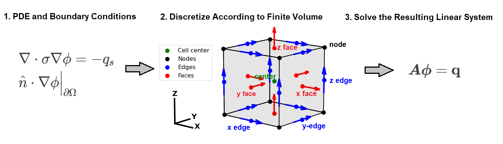

.. _finite_volume_index:

Intoduction to Finite Volume
****************************

What is Finite Volume?
----------------------

The finite volume method is a method for numerically approximating the solution to partial differential equations.
Implementation of the finite volume method requires the discretization of continuous functions and variables.
Discrete representations of functions and variables are organized on a numerical grid (or mesh).
The final product of the approach is a linear system of equations :math:`\boldsymbol{A \phi=q}`
that can be solved to compute the discrete approximation of a desired quantity.

   Conceptual illustrating for solving PDEs with the finite volume method.

In *discretize*, we use a staggered mimetic finite volume approach (`Hyman and
Shashkov, 1999 <https://cnls.lanl.gov/~shashkov/papers/maxjcp.pdf>`_).
This approach requires the definitions of variables at either cell-centers, nodes, faces, or edges.
This method is different from finite difference methods,
as the final linear system is constructed by approximating the inner products between
test functions and partial differential equations.

**Contents:**

	- :ref:`Meshes <meshes_index>`
	- :ref:`Interpolation, Averaging and Differential Operators <operators_index>`
	- :ref:`Inner Products <inner_products_index>`
	- :ref:`Discretizing PDEs Derivation Examples <derivation_examples_index>`

**Tutorials and Examples Gallery:**

  - :ref:`Mesh Generation <sphx_glr_tutorials_mesh_generation>`
  - :ref:`Interpolation, Averaging and Differential Operators <sphx_glr_tutorials_operators>`
  - :ref:`Inner Products <sphx_glr_tutorials_inner_products>`
  - :ref:`Discretizing PDEs Derivation Examples <sphx_glr_tutorials_pde>`
  - :ref:`Examples Gallery <sphx_glr_examples>`

Examples
--------

Below are several examples of the final linear system obtained using the finite volume approach.
A comprehensive derivation of the final result is not provided here. The full derivations are
provide in the :ref:`discretizing PDEs derivation examples <derivation_examples_index>` theory section.

Direct Current Resistivity
^^^^^^^^^^^^^^^^^^^^^^^^^^

The governing equation for the direct current resistivity problem is given by:

.. math::
	\nabla \cdot \sigma \nabla \phi = -q_s

where

	- :math:`\phi` is the electric potential
	- :math:`\sigma` is the electrical conductivity within the domain
	- :math:`q_s` is a general representation of the source term
	- :math:`\nabla` is the gradient operator
	- :math:`\nabla \cdot` is the divergence operator

If we choose to define the discrete representation of the electric potential on the nodes,
the solution for the electric potentials after applying the finite volume approach is given by:

.. math::
	\boldsymbol{[G^T \! M_{\sigma e} G ]} \boldsymbol{\phi} = \mathbf{q_s}

where :math:`\boldsymbol{G^T \! M_{\sigma e} G }` is a sparse matrix and

	- :math:`\boldsymbol{\phi}` is the discrete approximation to the electric potentials on the nodes
	- :math:`\boldsymbol{G}` is the :ref:`discrete gradient operator <operators_differential_gradient>`
	- :math:`\boldsymbol{M_{\sigma e}}` is the :ref:`mass matrix for electrical conductivity <inner_products_isotropic_edges>`
	- :math:`\boldsymbol{q_s}` is the discrete representation of the source term on the nodes

Frequency Domain Electromagnetics
^^^^^^^^^^^^^^^^^^^^^^^^^^^^^^^^^

The governing equations for the frequency domain electromagnetic problems,
for a source current, can be expressed using Maxwell's equations:

.. math::
	\begin{align}
	&\nabla \times \mu^{-1} \vec{B} - \sigma \vec{E} = \vec{J}_s \\
	&\nabla \times \vec{E} = - i\omega \vec{B}
	\end{align}

where

	- :math:`\vec{E}` is the electric field
	- :math:`\vec{B}` is the magnetic flux density
	- :math:`\vec{J}_s` is a general representation of the source term
	- :math:`\sigma` is the electrical conductivity within the domain
	- :math:`\mu` is the magnetic permeability within the domain
	- :math:`\omega` is the angular frequency
	- :math:`\nabla \times` is the curl operator

Here we choose to define the discrete representation of the electric field on edges
and the discrete representation of the magnetic flux density on faces.
The solution for the electric potentials after applying the finite volume approach is given by:

.. math::
	\begin{align}
	\boldsymbol{C^T \! M_{\mu f} \, b } - \boldsymbol{M_{\sigma e} \, e} = \mathbf{j_s} \\
	\mathbf{C \, e} = -i \omega \mathbf{b}
	\end{align}

which can be combined to form a single linear system:

.. math::
	\boldsymbol{[C^T \! M_{\mu f} C } + i\omega \boldsymbol{M_{\sigma e}]} \mathbf{e} = -i \omega \mathbf{j_s}

where :math:`\boldsymbol{C^T \! M_{\mu f} C } + i\omega \boldsymbol{M_{\sigma e}}` is a sparse matrix and

	- :math:`\boldsymbol{e}` is the discrete approximation to the electric field on edges
	- :math:`\boldsymbol{b}` is the discrete approximation to the magnetic flux density on faces
	- :math:`\boldsymbol{C}` is the :ref:`discrete curl operator <operators_differential_curl>`
	- :math:`\boldsymbol{M_{\sigma e}}` is the :ref:`mass matrix for electrical conductivity <inner_products_isotropic_edges>`
	- :math:`\boldsymbol{M_{\mu f}}` is the :ref:`mass matrix for the inverse of the magnetic permeability <inner_products_isotropic_reciprocal>`
	- :math:`\boldsymbol{j_s}` is the discrete representation of the source current density on the edges

