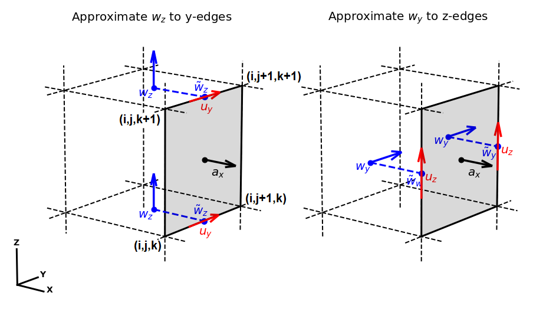

.. _inner_products_boundary_conditions:

Boundary Conditions
*******************

Introduction
------------

In :ref:`inner products containing differential operators <inner_products_differential>`,
we approximated inner products containing the gradient, the divergence and the curl.
If our choice in discretization does not respect the boundary conditions naturally,
we must construct a discrete approximation to a surface integral to impose the boundary conditions.
Here, we demonstrate how the boundary conditions are implemented discretely.

.. _inner_products_boundary_conditions_gradient:

Gradient
--------

Let :math:`\phi` be a scalar quantity and let :math:`\vec{u}` be a vector quantity.
If the discrete representation :math:`\boldsymbol{\phi}` lives at cell centers and
the discrete representation :math:`\boldsymbol{u}` lives on the faces,
the inner product is approximated by:

.. math::
    \int_\Omega \vec{u} \cdot \nabla \phi \, dv \approx - \boldsymbol{u^T D^T M_c \, \phi} + \oint_{\partial \Omega} \phi \hat{n} \cdot \vec{u} \, da
    :label: inner_products_boundary_conditions_1

where

    - :math:`\boldsymbol{D}` is a :ref:`discrete divergence operator <operators_differential_divergence>`
    - :math:`\boldsymbol{M_c}` is the :ref:`basic inner product matrix for quantities at cell centers <inner_products_basic>`

.. note:: To see how equation :eq:`inner_products_boundary_conditions_1` was obtained, visit :ref:`inner products with gradients <inner_products_differential_gradient_full>`.

.. figure:: ../../images/boundary_conditions_gradient.png
    :align: center
    :width: 300

    Figure 1: Boundary conditions for the gradient operator.

A discrete approximation to the surface integral in equation
:eq:`inner_products_boundary_conditions_1` which imposes
boundary conditions on :math:`\phi` can be expressed as: 

.. math::
    \oint_{\partial \Omega} \phi \hat{n} \cdot \vec{u} \, da \approx \boldsymbol{u^T} diag(\boldsymbol{\tilde{a}}) \,\boldsymbol{\tilde{\phi}}
    :label: inner_products_boundary_conditions_1a

where

    - :math:`\boldsymbol{u^T}` is the discrete representation of :math:`\vec{u}` on the faces
    - :math:`\boldsymbol{\tilde{\phi}}` is a discrete vector on the faces which contains the values of :math:`\phi` approximated on boundary faces
    - :math:`\boldsymbol{\tilde{a}}` is a vector which stores the dot products between the surface area vectors of the boundary faces :math:`\vec{a}` and the unit direction :math:`\hat{u} = \frac{\vec{u}}{|\vec{u}|}`. That is, :math:`\boldsymbol{\tilde{a}} = \hat{u} \cdot \vec{a}` for faces on the boundary and :math:`\boldsymbol{\tilde{a}}=0` for all interior faces.

Here, we describe how the vector :math:`\boldsymbol{\tilde{\phi}}` can be constructed to impose various boundary conditions.
    

Dirichlet
^^^^^^^^^

Examine :ref:`Figure 1 <inner_products_boundary_conditions_gradient>` and consider face :math:`k`.
When imposing Dirichlet conditions, we know the value of :math:`\phi` on the boundary
and we can construct :math:`\boldsymbol{\tilde{\phi}}` directly.
Let :math:`\boldsymbol{\tilde{\phi}}` be a discrete vector defined on the faces of the mesh
such that :math:`\boldsymbol{\tilde{\phi}} = \phi_k` for each face :math:`k` on the boundary
and :math:`\boldsymbol{\tilde{\phi}} = 0` for all interior faces.

To implement the boundary condition practically,
we construct a vector :math:`\boldsymbol{b} = diag(\boldsymbol{\tilde{a}}) \, \boldsymbol{\tilde{\phi}}`
that lives on the faces. For equation :eq:`inner_products_boundary_conditions_1` in the case of
Dirichlet boundary conditions we obtain:

.. math::
    \int_\Omega \vec{u} \cdot \nabla \phi \, dv \approx - \boldsymbol{u^T D^T M_c \, \phi + u^T b}
    :label: inner_products_boundary_conditions_1b

Neumann
^^^^^^^

According to equation :eq:`inner_products_boundary_conditions_1a`, we need to approximate :math:`\phi` on
the boundary faces when the derivative of :math:`\phi` normal to the surface is known.
For each face, we will approximate :math:`\phi` using a Taylor expansion.

Examine :ref:`Figure 1 <inner_products_boundary_conditions_gradient>`.
We let :math:`\phi_k` denote the value of :math:`\phi` on face :math:`k`,
we let :math:`\phi_c` denote the value of :math:`\phi` at the nearest cell center,
and :math:`\Delta s_k` denotes the path from from face :math:`k` to the cell center.
Where the derivative of :math:`\phi` normal to the surface for face :math:`k` is denoted by :math:`\frac{\partial \phi_k}{\partial n}`,
we can define the following Taylor expansion:

.. math::
    \phi_c = \phi_k + \frac{\partial \phi_k}{\partial n} \Delta s_k \; + \; ...

If we rearrange this equation, we can use the value at the center of the cell and the Neumann condition on the boundary
to approximate :math:`\phi` on the corresponding face, i.e.: 

.. math::
    \phi_k \approx \phi_c - \frac{\partial \phi_k}{\partial n} \Delta s_k

The same approach can be used to approximate :math:`\phi` on the other boundary faces of the mesh.
In this case, :math:`\boldsymbol{\tilde{\phi}}` in equation :eq:`inner_products_boundary_conditions_1a` can be expressed as:

.. math::
    \boldsymbol{\tilde{\phi}} = \boldsymbol{P_{cf} \phi + \tilde{b}} \;\;\;\;
    \textrm{where} \;\; \boldsymbol{\tilde{b}} = \begin{cases} 
    - \frac{\partial \phi_k}{\partial n} \Delta s_k \;\; \textrm{on boundary faces} \\
    0 \;\; \textrm{on interior faces}
    \end{cases}
    :label: inner_products_boundary_conditions_1c

where :math:`\boldsymbol{P_{cf}}` is a projection matrix from cell centers to faces and :math:`\boldsymbol{\tilde{b}}` is a vector that lives on the faces.
If we substitute equation :eq:`inner_products_boundary_conditions_1c` into equation :eq:`inner_products_boundary_conditions_1a`,
the surface integral is approximated by:

.. math::
    \oint_{\partial \Omega} \phi \hat{n} \cdot \vec{u} \, da \approx \boldsymbol{u^T} \, diag(\boldsymbol{\tilde{a}}) \, \big ( \boldsymbol{P_{cf} \phi + \tilde{b}} \big )
    :label: inner_products_boundary_conditions_1d

To implement the result in equation :eq:`inner_products_boundary_conditions_1d` practically,
let us construct
a matrix :math:`\boldsymbol{B} = diag(\boldsymbol{\tilde{a}}) \boldsymbol{P_{cf}}` and
a vector :math:`\boldsymbol{b} = diag(\boldsymbol{\tilde{a}}) \, \boldsymbol{\tilde{b}}`
that lives on the faces. For equation :eq:`inner_products_boundary_conditions_1` in the case of
Neumann boundary conditions we obtain:

.. math::
    \int_\Omega \vec{u} \cdot \nabla \phi \, dv \approx - \boldsymbol{u^T (D^T M_c - B) \, \phi + u^T b}
    :label: inner_products_boundary_conditions_1e

Mixed
^^^^^

Where :math:`\alpha`, :math:`\beta` and :math:`\gamma` are constants,
the boundary conditions are defined by the following ordinary differential equation:

.. math::
    \alpha \phi + \beta \frac{\partial \phi}{\partial n} = \gamma
    :label: inner_products_boundary_conditions_1f

Examine :ref:`Figure 1 <inner_products_boundary_conditions_gradient>`.
We let :math:`\phi_k` denote the value of :math:`\phi` on face :math:`k`,
we let :math:`\phi_c` denote the value of :math:`\phi` at the nearest cell center,
and :math:`\Delta s_k` denotes the path from from face :math:`k` to the cell center.
Where the derivative of :math:`\phi` normal to the surface for face :math:`k` is denoted by :math:`\frac{\partial \phi_k}{\partial n}`,
we can define the following Taylor expansion:

.. math::
    \phi_c = \phi_k + \frac{\partial \phi_k}{\partial n} \Delta s_k \; + \; ...
    :label: inner_products_boundary_conditions_1g

A first order approximation to the derivative on the boundary is given by:

.. math::
    \frac{\partial \phi_k}{\partial n} \approx \frac{\phi_c - \phi_k}{\Delta s_k}
    :label: inner_products_boundary_conditions_1h

Substituting equations :eq:`inner_products_boundary_conditions_1g` and :eq:`inner_products_boundary_conditions_1h` into equation :eq:`inner_products_boundary_conditions_1f` for face :math:`k` we obtain:

.. math::
    \phi_k = \Bigg ( \frac{\beta}{\beta - \alpha \Delta s_k} \Bigg ) \phi_c - \Bigg ( \frac{\gamma \Delta s_k}{\beta - \alpha \Delta s_k} \Bigg )
    :label: inner_products_boundary_conditions_1i

The same approach can be used to approximate :math:`\phi` on the other boundary faces of the mesh.

Let :math:`\boldsymbol{\tilde{b}_1}` be a discrete vector defined on the faces of the mesh such that :math:`\boldsymbol{\tilde{b_1}} = \frac{\beta}{\beta - \alpha \Delta s_k}` for faces on the boundary
and :math:`\boldsymbol{\tilde{b}_1} = 0` for all internal faces.
And let :math:`\boldsymbol{\tilde{b}_2}` be a discrete vector defined on the faces of the mesh
such that :math:`\boldsymbol{\tilde{b}_2} = - \frac{\gamma \Delta s_k}{\beta - \alpha \Delta s_k}` for faces on the boundary
and :math:`\boldsymbol{\tilde{b}_2} = 0` for all internal faces.
In this case, we define the following vector :math:`\boldsymbol{\tilde{\phi}}` that lives on cell faces:

.. math::
    \boldsymbol{\tilde{\phi}} = diag (\boldsymbol{\tilde{b}_1}) \, \boldsymbol{P_{cf} \, \phi + \tilde{b}_2}
    :label: inner_products_boundary_conditions_1j

where :math:`\boldsymbol{P_{cf}}` is a projection matrix from cell centers to faces.
If we substitute equation :eq:`inner_products_boundary_conditions_1j` into equation :eq:`inner_products_boundary_conditions_1a`,
the surface integral is approximated by:

.. math::
    \oint_{\partial \Omega} \phi \hat{n} \cdot \vec{u} \, da \approx \boldsymbol{u^T} \, diag(\boldsymbol{\tilde{a}}) \, \big ( diag (\boldsymbol{\tilde{b}_1}) \, \boldsymbol{P_{cf} \phi + \tilde{b}_2} \big )
    :label: inner_products_boundary_conditions_1k

To implement the result in equation :eq:`inner_products_boundary_conditions_1k` practically,
let us construct a matrix :math:`\boldsymbol{B} = diag \big ( \boldsymbol{\tilde{a} \odot \tilde{b}_1} \big ) \, \boldsymbol{P_{cf}}` and
a vector :math:`\boldsymbol{b} = diag(\boldsymbol{\tilde{a}}) \, \boldsymbol{\tilde{b}_2}`
that lives on the faces. For equation :eq:`inner_products_boundary_conditions_1` in the case of
Mixed boundary conditions we obtain:

.. math::
    \int_\Omega \vec{u} \cdot \nabla \phi \, dv \approx - \boldsymbol{u^T (D^T M_c - B) \, \phi + u^T b}
    :label: inner_products_boundary_conditions_1l

.. _inner_products_boundary_conditions_divergence:

Divergence
----------

Let :math:`\psi` be a scalar quantity and let :math:`\vec{w}` be a vector quantity.
If the discrete representation :math:`\boldsymbol{\psi}` lives on the nodes and
the discrete representation :math:`\boldsymbol{w}` lives on the edges,
the inner product is approximated by:

.. math::
    \int_\Omega \psi \; (\nabla \cdot \vec{w}) \, dv \approx - \boldsymbol{\psi^T G^T M_e \, w} + \oint_{\partial \Omega} \psi (\hat{n} \cdot \vec{w}) \, da
    :label: inner_products_boundary_conditions_2

where

    - :math:`\boldsymbol{G}` is a :ref:`discrete gradient operator <operators_differential_gradient>`
    - :math:`\boldsymbol{M_e}` is the :ref:`basic inner product matrix for vectors at edges <inner_products_basic>`

.. note:: To see how equation :eq:`inner_products_boundary_conditions_2` was obtained, visit :ref:`inner products with the divergence <inner_products_differential_divergence_full>`.

.. figure:: ../../images/boundary_conditions_divergence.png
    :align: center
    :width: 300

    Figure 2: Boundary conditions for the divergence operator.

A discrete approximation to the surface integral in equation
:eq:`inner_products_boundary_conditions_2` which imposes
boundary conditions on :math:`\vec{w}` can be expressed as: 

.. math::
    \oint_{\partial \Omega} \psi (\hat{n} \cdot \vec{w}) \, da \approx \boldsymbol{\psi^T P_{nf}^T} \, diag(\boldsymbol{\tilde{a}}) \, \boldsymbol{\tilde{w}}
    :label: inner_products_boundary_conditions_2a

where

    - :math:`\boldsymbol{\psi^T}` is the discrete representation of :math:`\psi` on the nodes
    - :math:`\boldsymbol{P_{nf}}` is sparse matrix that projects scalar quantities from nodes to faces
    - :math:`\boldsymbol{\tilde{a}}` is a vector which stores the dot products between the surface area vectors of the boundary faces :math:`\vec{a}` and the unit direction :math:`\hat{u} = \frac{\vec{u}}{|\vec{u}|}`. That is, :math:`\boldsymbol{\tilde{a}} = \hat{u} \cdot \vec{a}` for faces on the boundary and :math:`\boldsymbol{\tilde{a}}=0` for all interior faces.
    - :math:`\boldsymbol{\tilde{w}}` is a discrete vector which contains the x, y (and z) components of :math:`\vec{w}` approximated on boundary faces; i.e. :math:`\tilde{w}_x`, :math:`\tilde{w}_y` (and :math:`\tilde{w}_z`).

Here, we describe how the vector :math:`\boldsymbol{\tilde{w}}` can be constructed to impose various boundary conditions.

Dirichlet
^^^^^^^^^

Examine :ref:`Figure 1 <inner_products_boundary_conditions_gradient>`.
In the case of the Dirichlet condition, we know the value of :math:`\vec{w}` on the boundary
and we can construct :math:`\boldsymbol{\tilde{w}}` directly.
Let :math:`\boldsymbol{\tilde{w}}` be a discrete vector defined on the faces of the mesh
which organizes the x, y (and z components) as follows:

.. math::
    \boldsymbol{\tilde{w}} = \begin{bmatrix}
    \boldsymbol{\tilde{w}_x} \\ \boldsymbol{\tilde{w}_y} \\ \boldsymbol{\tilde{w}_z} \end{bmatrix}

For x-faces on the x-boundary, the entries of :math:`\boldsymbol{\tilde{w}_x}` equal the corresponding x-component of :math:`\vec{w}`.
And on all other x-faces, the entries are equal to zero.
This is similar for :math:`\boldsymbol{\tilde{w}_y}` and :math:`\boldsymbol{\tilde{w}_z}` which only have non-zero entries on y-faces
and z-faces, respectively.

To implement the boundary condition practically,
let us construct a vector :math:`\boldsymbol{b} = \boldsymbol{P_{nf}^T} \, diag(\boldsymbol{\tilde{a}}) \, \boldsymbol{\tilde{w}}`
that utlimately lives on the nodes. For equation :eq:`inner_products_boundary_conditions_2` in the case of
Dirichlet boundary conditions we obtain:

.. math::
    \int_\Omega \psi \; (\nabla \cdot \vec{w}) \, dv \approx - \boldsymbol{\psi^T G^T M_e \, w + \psi^T b}
    :label: inner_products_boundary_conditions_2b

Neumann
^^^^^^^

According to equation :eq:`inner_products_boundary_conditions_2a`, we need to construct the dicrete face vector
:math:`\boldsymbol{\tilde{w}}` when the derivative normal to the surface is known.

Now examine :ref:`Figure 2 <inner_products_boundary_conditions_divergence>`.
Since the discrete vector :math:`\boldsymbol{w}` is lives on the edges,
we start by defining a Taylor expansion at node :math:`k`.
We let :math:`w_k` denote the approximation of the x component of :math:`\vec{w}` on node :math:`k`,
we let :math:`w_x` denote the x component of :math:`\vec{w}` at the nearest x-edge,
and :math:`\Delta s_k` denotes the path from node :math:`k` to that edge.

Where the derivative of :math:`\vec{w}` normal to the surface at node :math:`k` is known and is denoted by :math:`\frac{\partial w_k}{\partial n}`,
we can define the following Taylor expansion:

.. math::
    w_x = w_k + \frac{\partial w_k}{\partial n} \Delta s_k \; + \; ...

If we rearrange this equation, we can use the value on the x-edge and the Neumann condition on the boundary
to approximate the component of :math:`\vec{w}` on the corresponding x-face, i.e.: 

.. math::
    w_k \approx w_x - \frac{\partial w_k}{\partial n} \Delta s_k
    :label: inner_products_boundary_conditions_2b

The same approach can be used to approximate the value on the other x-boundary faces of the mesh.
In this case:

.. math::
    \boldsymbol{\tilde{w}_x} = \boldsymbol{P_{fx}} \big ( \boldsymbol{P_{ex} w_x + \tilde{b}_x} \big )
    \;\;\; \textrm{where} \;\;\;
    \boldsymbol{\tilde{b}_x} = \begin{cases} 
    - \frac{\partial w_k}{\partial n} \Delta s_k \;\; \textrm{on x-boundary nodes} \\
    0 \;\; \textrm{on all other nodes}
    \end{cases}
    :label: inner_products_boundary_conditions_2c

and where :math:`\boldsymbol{P_{fx}}` is a projection matrix from nodes to x-faces, :math:`\boldsymbol{P_{ex}}` is a projection matrix from x-edges to nodes, and :math:`\boldsymbol{\tilde{b}_x}` is a vector that lives on the nodes.
The same approach can be applied for y and z boundaries.

To compute the vector :math:`\boldsymbol{w}` in equation :eq:`inner_products_boundary_conditions_2a`,
we must combine the Cartesian components. This results in the followin expression:

.. math::
    \boldsymbol{\tilde{w}} = \boldsymbol{\tilde{P}_{nf}} \big ( \boldsymbol{\tilde{P}_{en} w + \tilde{b}} \big )
    :label: inner_products_boundary_conditions_2d

such that:

.. math::
    \boldsymbol{\tilde{w}} \! = \! \begin{bmatrix} \boldsymbol{\tilde{w}_x} \\ \boldsymbol{\tilde{w}_y} \\ \boldsymbol{\tilde{w}_z} \end{bmatrix}
    \textrm{,}\;\;
    \boldsymbol{\tilde{P}_{nf}} \! = \! \begin{bmatrix} \boldsymbol{P_{fx}} & 0 & 0 \\ 0 & \boldsymbol{P_{fy}} & 0 \\ 0 & 0 & \boldsymbol{P_{fz}} \end{bmatrix}
    \textrm{,}\;\;
    \boldsymbol{\tilde{P}_{en}} \! = \! \begin{bmatrix} \boldsymbol{P_{ex}} & 0 & 0 \\ 0 & \boldsymbol{P_{ey}} & 0 \\ 0 & 0 & \boldsymbol{P_{ez}} \end{bmatrix}
    \;\textrm{and}\;\;
    \boldsymbol{\tilde{b}} \! = \! \begin{bmatrix} \boldsymbol{\tilde{b}_x} \\ \boldsymbol{\tilde{b}_y} \\ \boldsymbol{\tilde{b}_z} \end{bmatrix}
    :label: inner_products_boundary_conditions_2e

.. important:: It should be noted that :math:`\boldsymbol{P_{nf}}` in equation :eq:`inner_products_boundary_conditions_2a` is **not** the same as :math:`\boldsymbol{\tilde{P}_{nf}}` in equation :eq:`inner_products_boundary_conditions_2d`! Whereas :math:`\boldsymbol{P_{nf}}` maps a scalar quantity from nodes to all faces, :math:`\boldsymbol{\tilde{P}_{nf}}` maps a vector quantity whose vector components are defined on all nodes to their respective faces.

To implement the result in equation :eq:`inner_products_boundary_conditions_2e` practically,
we expression equation :eq:`inner_products_boundary_conditions_1` in the case of
Neumann boundary conditions as:

.. math::
    \int_\Omega \vec{u} \cdot \nabla \phi \, dv \approx - \boldsymbol{u^T [D^T M_c - B] \, \phi + u^T b}
    :label: inner_products_boundary_conditions_2f

where

    - :math:`\boldsymbol{B} = \boldsymbol{P_{nf}^T} \, diag(\boldsymbol{\tilde{a}}) \, \boldsymbol{\tilde{P}_{nf}} \boldsymbol{\tilde{P}_{en}}`
    - :math:`\boldsymbol{b} = \boldsymbol{P_{nf}^T} \, diag(\boldsymbol{\tilde{a}}) \, \boldsymbol{\tilde{P}_{nf}} \boldsymbol{\tilde{b}}`

Mixed
^^^^^

Where :math:`\alpha`, :math:`\beta` and :math:`\gamma` are constants,
the boundary conditions are defined by the following ordinary differential equation:

.. math::
    \alpha \phi + \beta \frac{\partial \phi}{\partial n} = \gamma
    :label: inner_products_boundary_conditions_2g

Examine :ref:`Figure 2 <inner_products_boundary_conditions_divergence>`.
Since the discrete vector :math:`\boldsymbol{w}` is defined on the edges,
we start by defining a Taylor expansion at node :math:`k`.
We let :math:`w_k` denote the approximation of the x component of :math:`\vec{w}` on node :math:`k`,
we let :math:`w_x` denote the x component of :math:`\vec{w}` at the nearest x-edge,
and :math:`\Delta s_k` denotes the path from from node :math:`k` to that edge.

Where the derivative of :math:`\vec{w}` normal to the surface at node :math:`k` is known and is denoted by :math:`\frac{\partial w_k}{\partial n}`,
we can define the following Taylor expansion:

.. math::
    w_x = w_k + \frac{\partial w_k}{\partial n} \Delta s_k \; + \; ...
    :label: inner_products_boundary_conditions_2h

A first order approximation to the derivative on the boundary is given by:

.. math::
    \frac{\partial w_k}{\partial n} \approx \frac{w_x - w_k}{\Delta s_k}
    :label: inner_products_boundary_conditions_2i

Substituting equations :eq:`inner_products_boundary_conditions_2h` and :eq:`inner_products_boundary_conditions_2i` into equation :eq:`inner_products_boundary_conditions_2g` for face :math:`k` we obtain:

.. math::
    w_k = \Bigg ( \frac{\beta}{\beta - \alpha \Delta s_k} \Bigg ) w_x - \Bigg ( \frac{\gamma \Delta s_k}{\beta - \alpha \Delta s_k} \Bigg )
    :label: inner_products_boundary_conditions_2j

Let :math:`\boldsymbol{\tilde{w}_x}` be a vector defined on the nodes of the mesh such that :math:`\boldsymbol{\tilde{w}_x}` equals the approximation :math:`\tilde{w}_x` for nodes touching the x boundary and :math:`\boldsymbol{\tilde{w}_x}` equals zero for all other nodes.
This vector can be computed according to the following expression:

.. math::
    \boldsymbol{\tilde{w}_x} = \boldsymbol{P_{fx}} \big ( diag ( \boldsymbol{\tilde{c}_x} ) \, \boldsymbol{P_{ex} w_x + \tilde{d}_x} \big )
    :label: inner_products_boundary_conditions_2k

where :math:`\boldsymbol{P_{fx}}` and :math:`\boldsymbol{P_{ex}}` are projection matrices that were defined in equation :eq:`inner_products_boundary_conditions_2c`.
Let :math:`\boldsymbol{\tilde{c}_x}` be a discrete vector defined on the faces of the mesh such that:

.. math::
    \boldsymbol{\tilde{c}_x} = \begin{cases} \frac{\beta}{\beta - \alpha \Delta s_k} \;\;\textrm{on nodes on the x-boundary}\\ 0 \;\; \textrm{on all other nodes} \end{cases}

And let :math:`\boldsymbol{\tilde{d}_x}` be a discrete vector defined on the nodes of the mesh such that:

.. math::
    \boldsymbol{\tilde{d}_x} = \begin{cases} - \frac{\gamma \Delta s_k}{\beta - \alpha \Delta s_k} \;\;\textrm{on nodes on the x-boundary}\\ 0 \;\; \textrm{on all other nodes} \end{cases}

The same approach can be applied for y and z boundaries.
To compute the vector :math:`\boldsymbol{w}` in equation :eq:`inner_products_boundary_conditions_2a`,
we must combine the Cartesian components. This results in the followin expression:

.. math::
    \boldsymbol{\tilde{w}} = \boldsymbol{\tilde{P}_{nf}} \big ( diag ( \boldsymbol{\tilde{c}} ) \boldsymbol{\tilde{P}_{en} w + \tilde{d}} \big )
    :label: inner_products_boundary_conditions_2l

where :math:`\boldsymbol{\tilde{w}}`, :math:`\boldsymbol{\tilde{P}_{nf}}` and :math:`\boldsymbol{\tilde{P}_{en}}`
were defined in equation :eq:`inner_products_boundary_conditions_2d`. And where:

.. math::
    \boldsymbol{\tilde{c}} \! = \! \begin{bmatrix} \boldsymbol{\tilde{c}_x} \\ \boldsymbol{\tilde{c}_y} \\ \boldsymbol{\tilde{c}_z} \end{bmatrix}
    \;\textrm{and}\;\;
    \boldsymbol{\tilde{d}} \! = \! \begin{bmatrix} \boldsymbol{\tilde{d}_x} \\ \boldsymbol{\tilde{d}_y} \\ \boldsymbol{\tilde{d}_z} \end{bmatrix}
    :label: inner_products_boundary_conditions_2m

To implement the result in equation :eq:`inner_products_boundary_conditions_2m` practically,
we expression equation :eq:`inner_products_boundary_conditions_1` in the case of
Neumann boundary conditions as:

.. math::
    \int_\Omega \vec{u} \cdot \nabla \phi \, dv \approx - \boldsymbol{u^T (D^T M_c - B) \, \phi + u^T b}
    :label: inner_products_boundary_conditions_1n

where

    - :math:`\boldsymbol{B} = \boldsymbol{P_{nf}^T} \, diag(\boldsymbol{\tilde{a}}) \, \boldsymbol{\tilde{P}_{nf}} \, diag ( \boldsymbol{\tilde{c}} )  \boldsymbol{\tilde{P}_{en}}`
    - :math:`\boldsymbol{b} = \boldsymbol{P_{nf}^T} \, diag(\boldsymbol{\tilde{a}}) \, \boldsymbol{\tilde{P}_{nf}} \boldsymbol{\tilde{d}}`

.. _inner_products_boundary_conditions_curl:

Curl
----

Let :math:`\vec{u}` and :math:`\vec{w}` be vector quantities.
If the discrete representation :math:`\boldsymbol{u}` lives on the edges and
the discrete representation :math:`\boldsymbol{w}` lives on the faces,
the inner product is approximated by:

.. math::
    \int_\Omega \vec{u} \cdot (\nabla \times \vec{w}) \, dv 
    \approx \boldsymbol{u^T C^T M_f \, w} - \oint_{\partial \Omega} (\vec{u} \times \vec{w}) \cdot d\vec{a}
    :label: inner_products_boundary_conditions_3

where

    - :math:`\boldsymbol{C}` is a :ref:`discrete curl operator <operators_differential_curl>`
    - :math:`\boldsymbol{M_f}` is the :ref:`basic inner product matrix for vectors on cell faces <inner_products_basic>`

    Figure 3: Quantities used to implement boundary conditions on the curl for an x-face.

A discrete approximation to the surface integral in equation
:eq:`inner_products_boundary_conditions_3` which imposes
boundary conditions on :math:`\vec{w}` can be expressed as: 

.. math::
    \oint_{\partial \Omega} (\vec{u} \times \vec{w}) \cdot d\vec{a}
    \approx \boldsymbol{u^T}
    \begin{bmatrix} \boldsymbol{P_1} \\ \boldsymbol{P_2} \end{bmatrix}^T
    \begin{bmatrix} \boldsymbol{\Lambda} & \boldsymbol{0} \\ \boldsymbol{0} & \boldsymbol{-\Lambda} \end{bmatrix}
    \begin{bmatrix} \boldsymbol{P_1} & \boldsymbol{0} \\ \boldsymbol{0} & \boldsymbol{P_2} \end{bmatrix}
    \boldsymbol{\tilde{w}}
    :label: inner_products_boundary_conditions_3a

where

.. math::
    \boldsymbol{P_1} =
    \begin{bmatrix}
    0 & P_{yx} & 0 \\ 0 & 0 & P_{zy} \\ P_{xz} & 0 & 0 
    \end{bmatrix}
    \textrm{,} \;\;
    \boldsymbol{P_2} =
    \begin{bmatrix}
    0 & 0 & P_{zx} \\ P_{xy} & 0 & 0 \\ 0 & P_{yz} & 0 
    \end{bmatrix}
    \textrm{,} \;\;
    \boldsymbol{\Lambda} = diag(\boldsymbol{\tilde{a}}) 
    \;\; \textrm{and}\;\;
    \boldsymbol{\tilde{w}} =
    \begin{bmatrix}
    \boldsymbol{\tilde{w}_{yx}} \\ \boldsymbol{\tilde{w}_{zy}} \\ \boldsymbol{\tilde{w}_{xz}} \\
    \boldsymbol{\tilde{w}_{zx}} \\ \boldsymbol{\tilde{w}_{xy}} \\ \boldsymbol{\tilde{w}_{yz}}
    \end{bmatrix}

such that

    - :math:`\boldsymbol{u}` is the discrete representation of :math:`\vec{u}` on edges
    - :math:`P_{ij}` is sparse matrix that projects a quantity from :math:`i` edges to :math:`j` faces for :math:`i,j=x,y,z`
    - :math:`\boldsymbol{\tilde{w}_{ij}}` is a vector that stores an approximation of component :math:`i` of :math:`\vec{w}` on :math:`j` edges for :math:`i,j=x,y,z`
    - :math:`\boldsymbol{\tilde{a}}` is a vector which stores the dot products between the surface area vectors of the boundary faces :math:`\vec{a}` and the unit direction of :math:`\vec{u} \times \vec{w}`. That is, :math:`\boldsymbol{\tilde{a}} = \pm a` for faces on the boundary and :math:`\boldsymbol{\tilde{a}}=0` for all interior faces

If we are able to construct matrices :math:`\boldsymbol{P_{ij}}` and :math:`\boldsymbol{\Lambda}`, we must turn our attention
to constructing :math:`\boldsymbol{\tilde{w}}`.

Dirichlet
^^^^^^^^^

For a 3D mesh, examine a single boundary cell whose surface area vector points in the x-direction
(:ref:`Figure 3 <inner_products_boundary_conditions_curl>`); i.e. :math:`\vec{a} = a\hat{x}`.
When imposing Dirichlet conditions, we know the value of :math:`\vec{w}` on the boundary.
For boundary face :math:`k` on the aforemention cell, the contribution towards the surface integral is given by:

.. math::
    \oint_{\partial \Omega_k} (\vec{u} \times \vec{w}) \, d\vec{a} = \int_{\partial \Omega_k} (u_y \tilde{w}_z - u_z \tilde{w}_y) \, da
    :label: inner_products_boundary_conditions_3b

where :math:`\tilde{w}_y` and :math:`\tilde{w}_z` are component values of :math:`\vec{w}` at the same edge
locations as :math:`u_z` and :math:`u_y`, respectively. Thus for boundary face :math:`k`
with surface area :math:`a_k`, the approximate contribution towards the surface integral
denoted by equation :eq:`inner_products_boundary_conditions_3b` is:

.. math::
    \oint_{\partial \Omega_k} (\vec{u} \times \vec{w}) \cdot d\vec{a} = \frac{a_k}{4} \! & \bigg [ \!
    \bigg ( \! u_y \big ( i, j\! +\! \tfrac{1}{2}, k \big ) \! +\! u_y \big ( i, j\! +\! \tfrac{1}{2}, k\! +\! 1 \big ) \! \bigg ) \!
    \bigg ( \! \tilde{w}_z \big ( i, j\! +\! \tfrac{1}{2}, k \big ) \! +\! \tilde{w}_z \big ( i, j\! +\! \tfrac{1}{2}, k\! +\! 1 \big ) \! \bigg ) \\
    -& \bigg ( \! u_z \big ( i, j, k\! +\! \tfrac{1}{2} \big ) \! +\! u_z \big ( i, j\! +\! 1, k\! +\! \tfrac{1}{2} \big ) \! \bigg ) \!
    \bigg ( \! \tilde{w}_y \big ( i, j, k\! +\! \tfrac{1}{2} \big ) \! +\! \tilde{w}_y \big ( i, j\! +\! 1, k\! +\! \tfrac{1}{2} \big ) \! \bigg ) \! \Bigg ]
    :label: inner_products_boundary_conditions_3c

Assuming we have constructed matrices :math:`\boldsymbol{P_{ij}}` and :math:`\boldsymbol{\Lambda}`,
we can construct a vector :math:`\boldsymbol{\tilde{w}}` such that values :math:`\vec{w}` on boundary edges are defined
by the boundary condition and :math:`\vec{w}` on interior edges are set to zero.

Neumann
^^^^^^^

According to equation :eq:`inner_products_boundary_conditions_3a`, we need to construct a large edge vector
:math:`\boldsymbol{\tilde{w}}` when the derivative normal to the surface is known.
When imposing the Neuwmann condition, we know the value of :math:`\frac{\partial \vec{w}}{\partial n}` on the boundary.
For a 3D mesh, examine a single boundary cell whose surface area vector points in the x-direction
(:ref:`Figure 3 <inner_products_boundary_conditions_curl>`); i.e. :math:`\vec{a} = a\hat{x}`.

Once again, we define a Taylor expansion to approximated the values of functions on the boundary.
For :math:`w_z`, we define a Taylor expansion at position :math:`(i, j \! + \! \tfrac{1}{2},k)`.
Solving the approximation :math:`\tilde{w}_z` on the boundary we obtain:

.. math::
    \tilde{w}_z (i, j \! + \! \tfrac{1}{2},k) = w_z (i \! - \! \tfrac{1}{2}, j \! + \! \tfrac{1}{2},k) - \frac{\partial w_z}{\partial n} \Delta s_x
    :label: inner_products_boundary_conditions_3d

where :math:`\Delta s_x` is the path from position :math:`(i, j \! + \! \tfrac{1}{2},k)`
to position :math:`(i \! - \! \tfrac{1}{2}, j \! + \! \tfrac{1}{2},k)`.
Similarly for :math:`w_y`:

.. math::
    \tilde{w}_y (i, j, k \! + \! \tfrac{1}{2}) = w_y (i \! - \! \tfrac{1}{2}, j, k \! + \! \tfrac{1}{2}) - \frac{\partial w_y}{\partial n} \Delta s_x
    :label: inner_products_boundary_conditions_3e

The same approach can be used to approximate the value of all required components on all boundary edges.
Much like we did for the gradient and divergence operators, we can define the vector :math:`\boldsymbol{\tilde{w}}` in terms of a linear operation:

.. math::
    \boldsymbol{\tilde{w}} = \boldsymbol{\tilde{P} w + \tilde{b}}
    :label: inner_products_boundary_conditions_3f

where

    - :math:`\boldsymbol{\tilde{P}}` maps the entries of :math:`\boldsymbol{w}` to the edges where they are needed
    - :math:`\boldsymbol{\tilde{b}}` is :math:`-\frac{\partial w_k}{\partial n}` on boundary faces and 0 for interior faces

To implement the result in equation :eq:`inner_products_boundary_conditions_3f` practically,
we express equation :eq:`inner_products_boundary_conditions_3` in the case of
Neumann boundary conditions as:

.. math::
    \int_\Omega \vec{u} \cdot (\nabla \times \vec{w}) \, dv 
    \approx \boldsymbol{u^T (C^T M_f - B ) \, w - u^T b}
    :label: inner_products_boundary_conditions_3g

where

.. math::
    \boldsymbol{B} = \begin{bmatrix} \boldsymbol{P_1} \\ \boldsymbol{P_2} \end{bmatrix}^T
    \begin{bmatrix} \boldsymbol{\Lambda} & \boldsymbol{0} \\ \boldsymbol{0} & \boldsymbol{-\Lambda} \end{bmatrix}
    \begin{bmatrix} \boldsymbol{P_1} & \boldsymbol{0} \\ \boldsymbol{0} & \boldsymbol{P_2} \end{bmatrix}
    \boldsymbol{\tilde{P}}

and

.. math::
    \boldsymbol{b} = \begin{bmatrix} \boldsymbol{P_1} \\ \boldsymbol{P_2} \end{bmatrix}^T
    \begin{bmatrix} \boldsymbol{\Lambda} & \boldsymbol{0} \\ \boldsymbol{0} & \boldsymbol{-\Lambda} \end{bmatrix}
    \begin{bmatrix} \boldsymbol{P_1} & \boldsymbol{0} \\ \boldsymbol{0} & \boldsymbol{P_2} \end{bmatrix} \boldsymbol{\tilde{b}}

Mixed
^^^^^

Where :math:`\alpha`, :math:`\beta` and :math:`\gamma` are constants,
the boundary conditions are defined by the following ordinary differential equation:

.. math::
    \alpha \phi + \beta \frac{\partial \phi}{\partial n} = \gamma
    :label: inner_products_boundary_conditions_3h

In this case, the Taylor expansions described in expressios :eq:`inner_products_boundary_conditions_3d`
and :eq:`inner_products_boundary_conditions_3e` become:

.. math::
    \tilde{w}_z (i, j \! + \! \tfrac{1}{2},k) =
    \Bigg ( \frac{\beta}{\beta - \alpha \Delta s_x} \Bigg ) w_z (i \! - \! \tfrac{1}{2}, j \! + \! \tfrac{1}{2},k)
    - \Bigg ( \frac{\gamma \Delta s_x}{\beta - \alpha \Delta s_x} \Bigg )

and

.. math::
    \tilde{w}_y (i, j,k \! + \! \tfrac{1}{2}) =
    \Bigg ( \frac{\beta}{\beta - \alpha \Delta s_x} \Bigg ) w_y (i \! - \! \tfrac{1}{2}, j,k \! + \! \tfrac{1}{2})
    - \Bigg ( \frac{\gamma \Delta s_x}{\beta - \alpha \Delta s_x} \Bigg )

where the derivatives were approximated to first order using backward difference.
Once again, the Taylor expansion can be used to approximate all required components of :math:`\vec{w}`
at all necessary boundary edges.

Similarly to how we defined :math:`\boldsymbol{\tilde{w}}` in :eq:`inner_products_boundary_conditions_3f`, we obtain:

.. math::
    \boldsymbol{\tilde{w}} = diag(\boldsymbol{\tilde{c}}) \boldsymbol{\tilde{P} w + \tilde{d}}
    :label: inner_products_boundary_conditions_3i

where

.. math::
    \boldsymbol{\tilde{c}} = \begin{cases} \frac{\beta}{\beta - \alpha \Delta s_k} \;\;\textrm{on boundary edges}\\ 0 \;\; \textrm{on all other edges} \end{cases}

and

.. math::
    \boldsymbol{\tilde{d}} = \begin{cases} - \frac{\gamma \Delta s_k}{\beta - \alpha \Delta s_k} \;\;\textrm{on boundary edges}\\ 0 \;\; \textrm{on all other other edges} \end{cases}

To implement the result in equation :eq:`inner_products_boundary_conditions_3i` practically,
we express equation :eq:`inner_products_boundary_conditions_3` in the case of
Neumann boundary conditions as:

.. math::
    \int_\Omega \vec{u} \cdot (\nabla \times \vec{w}) \, dv 
    \approx \boldsymbol{u^T (C^T M_f - B ) \, w - u^T b}
    :label: inner_products_boundary_conditions_3g

where

.. math::
    \boldsymbol{B} = \begin{bmatrix} \boldsymbol{P_1} \\ \boldsymbol{P_2} \end{bmatrix}^T
    \begin{bmatrix} \boldsymbol{\Lambda} & \boldsymbol{0} \\ \boldsymbol{0} & \boldsymbol{-\Lambda} \end{bmatrix}
    \begin{bmatrix} \boldsymbol{P_1} & \boldsymbol{0} \\ \boldsymbol{0} & \boldsymbol{P_2} \end{bmatrix}
    diag(\boldsymbol{\tilde{c}}) \boldsymbol{\tilde{P}}

and

.. math::
    \boldsymbol{b} = \begin{bmatrix} \boldsymbol{P_1} \\ \boldsymbol{P_2} \end{bmatrix}^T
    \begin{bmatrix} \boldsymbol{\Lambda} & \boldsymbol{0} \\ \boldsymbol{0} & \boldsymbol{-\Lambda} \end{bmatrix}
    \begin{bmatrix} \boldsymbol{P_1} & \boldsymbol{0} \\ \boldsymbol{0} & \boldsymbol{P_2} \end{bmatrix} \boldsymbol{\tilde{d}}

