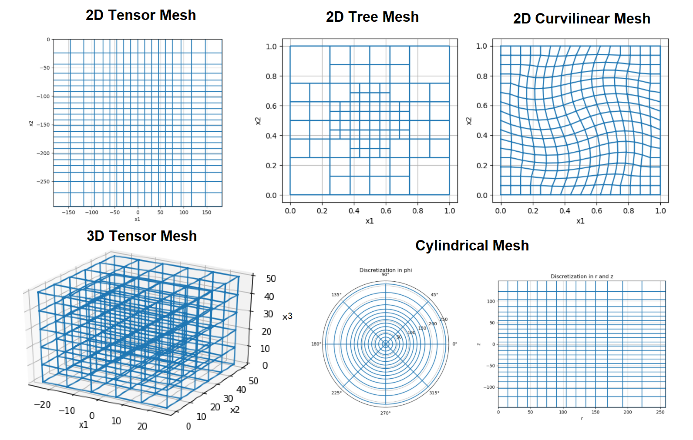

.. _meshes_index:

Meshes
******

A mesh is a numerical grid on which discrete approximations of continuous functions and variables live.
Meshes can be created to discretize and solve 1D, 2D or 3D problems.
For a given system of partial differential equations, the mesh is a discrete representation of the domain and its boundaries.
Here, we demonstrate:

	- mesh types supported by the *discretize* package
	- where discrete quantities live (mesh locations)

Mesh Types
==========

Mesh types supported by the *discretize* package include:

	- **Tensor Meshes:** A mesh where the grid locations are organized according to tensor products
	- **Tree Meshes:** A mesh where the dimensions of cells are :math:`2^n` larger than the dimension of the smallest cell size
	- **Curvilinear Meshes:** A tensor mesh where the axes are curvilinear
	- **Cylindrical Meshes:** A pseudo-2D mesh for solving 3D problems with perfect symmetry in the radial direction

Examples are illustrate below.

Where Quantities Live
=====================

In *discretize*, we use a staggered mimetic finite volume approach (`Hyman and
Shashkov, 1999 <https://cnls.lanl.gov/~shashkov/papers/maxjcp.pdf>`_).
This approach requires the definitions of variables at either cell-centers, nodes, faces, or edges.
Below, we illustrate the valid locations for discrete quantities for a single cell where:

	- **Nodes** represent location of intersection between grid lines defining the mesh.
	- **X, Y and Z edges** are edges whose tangent lines are parallel to the X, Y and Z axis, respectively.
	- **X, Y and Z faces** are faces which are normal to the X, Y and Z axis, respectively.

.. image:: ../../images/cell_locations.png
    :align: center
    :width: 700

