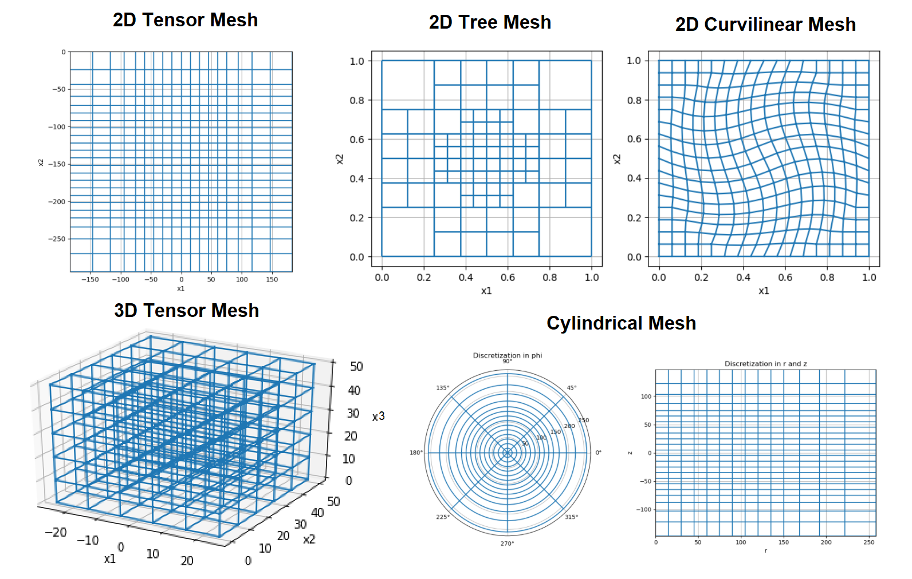
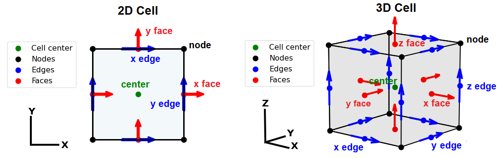

.. _meshes_index:

Meshes
******

A mesh is a numerical grid on which discrete approximations of continuous functions and variables live.
Meshes can be created to discretize and solve 1D, 2D or 3D problems.
For a given system of partial differential equations, the mesh is a discrete representation of the domain and its boundaries.
Here, we demonstrate mesh types supported by the *discretize* package, and where discrete quantities live.

**Contents:**

  - :ref:`Mesh Types<meshes_index_types>`
  - :ref:`Where Quantities Live <meshes_index_quantities>`

**Tutorials:**

  - :ref:`Mesh Types Overview <sphx_glr_tutorials_mesh_generation_1_mesh_overview.py>`
  - :ref:`Tensor Meshes <sphx_glr_tutorials_mesh_generation_2_tensor_mesh.py>`
  - :ref:`Cylindrical Meshes <sphx_glr_tutorials_mesh_generation_3_cylindrical_mesh.py>`
  - :ref:`Tree Meshes <sphx_glr_tutorials_mesh_generation_4_tree_mesh.py>`

.. _meshes_index_types:

Mesh Types
==========

Mesh types supported by the *discretize* package include:

    - **Tensor Meshes:** A mesh where the grid locations are organized according to tensor products
    - **Tree Meshes:** A mesh where the dimensions of cells are :math:`2^n` larger than the dimension of the smallest cell size
    - **Curvilinear Meshes:** A tensor mesh where the axes are curvilinear
    - **Cylindrical Meshes:** A pseudo-2D mesh for solving 3D problems with perfect symmetry in the radial direction

    Examples of different mesh types supported by the *discretize* package.

.. _meshes_index_quantities:

Where Quantities Live
=====================

In *discretize*, we use a staggered mimetic finite volume approach :cite:`haber2014,HymanShashkov1999`.
This approach requires the definitions of variables at either cell-centers, nodes, faces, or edges.
Below, we illustrate the valid locations for discrete quantities for a single cell where:

  - **Center:** the location at the center of each cell.
  - **Nodes:** locations of intersection between grid lines defining the mesh.
  - **X, Y and Z edges:** edges whose tangent lines are parallel to the X, Y and Z axes, respectively.
  - **X, Y and Z faces:** faces which are normal to the orientation of the X, Y and Z axes, respectively.

    Locations of centers, nodes, faces and edges for 2D cells (left) and 3D cells (right).

